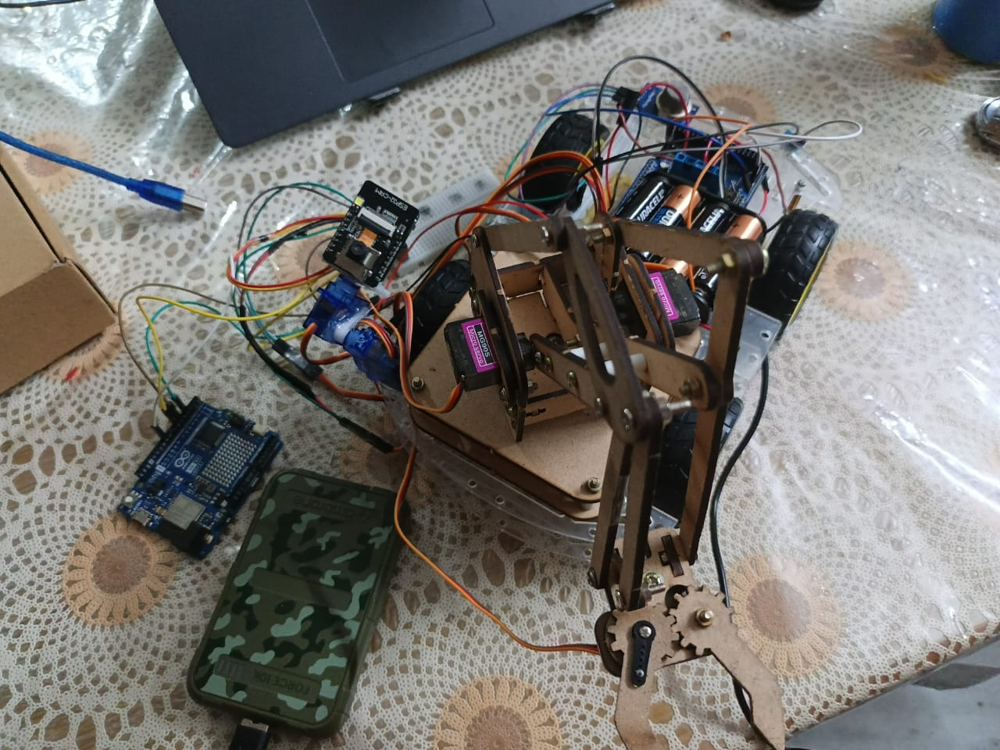
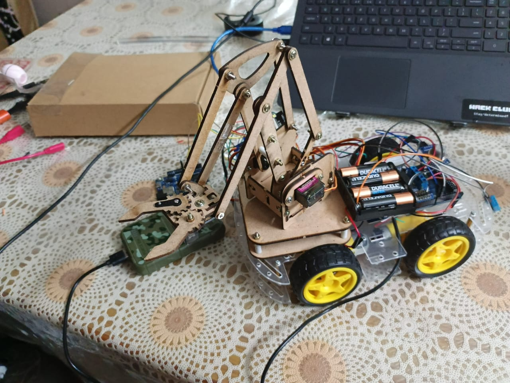

---

title: "SCAR"
author: "Akshat Jain"
description: "An Arduino and ESP based robotics project with a car, sensors, robotic arm and camera."
created_at: "2026-08-17"
------------------------

# August 17: Starting SCAR

I started going through the SCAR project and split the different parts into separate programs. I kept the car, arm and camera separate instead of trying to put everything into one sketch.

The three main files are `RoboCar.ino`, `RoboArm.ino` and `ESPCam.ino`.

I also collected the existing photos and videos so they could all go into the repository.

**Total time spent: 2 hours**

# August 18: Getting the car moving

I worked on `RoboCar.ino` today.

The car uses four DC motors through the AFMotor library. I added the basic serial commands for moving forward, backward, left, right and stopping.

The motor speed is set to 200 in the program.

The main commands are:

`f` for forward, `b` for backward, `l` for left, `r` for right and `s` for stop.

**Total time spent: 3 hours**

# August 19: Adding the sensors

I worked on the sensors in `RoboCar.ino`.

The DHT11 is connected to A9 and the MQ-2 is connected to A8. The DHT11 is used for temperature and humidity, while the MQ-2 is read as an analog value.

I added separate serial commands for reading them. `t` prints the DHT readings and `q` prints the MQ-2 value.

One useful part of doing it this way was that the sensor readings don't have to constantly be printed while controlling the car.

**Total time spent: 2 hours**

# August 20: Adding the two car servos

I added the two servos used by the main car program.

Servo 1 is on pin 9 and servo 2 is on pin 10. Both start at 90 degrees.

I used commands in the form `s1 90` and `s2 90` to set their positions. The program also checks that the angle is between 0 and 180.

**Total time spent: 2 hours**

# August 21: Working on the robotic arm

I worked on `RoboArm.ino` separately from the car.

The arm uses four servos on pins 3, 5, 6 and 9. They all start at 90 degrees.

The serial command format is simple:

`s1 <angle>`

`s2 <angle>`

`s3 <angle>`

`s4 <angle>`

The program checks the servo number and angle before moving the servo.

**Total time spent: 3 hours**

# August 22: Working on ESPCam

I worked on `ESPCam.ino`.

The ESP camera connects to Wi-Fi and starts a web server. The camera feed is provided as a stream and there is also a flash control.

The camera is kept separate from the Arduino programs, so it has its own code and its own setup.

**Total time spent: 3 hours**

# August 23: Final testing and organizing

I went back through the different parts of SCAR and checked that the project was separated properly.

The final setup has:

* `RoboCar.ino` for the four motors, two servos and sensors
* `RoboArm.ino` for the four arm servos
* `ESPCam.ino` for the camera and web interface

I also organized the project photos and videos and finished putting the files into the repository.

**Total time spent: 3 hours**
